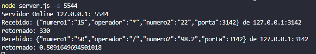
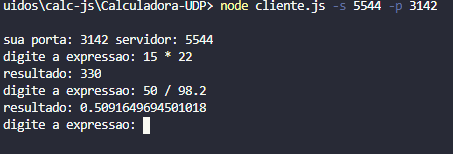
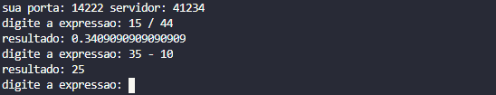

# Calculadora-UDP
 Calculadora UDP em node.js para a disciplina de sistemas distribuidos  

## Etapas do desenvolvimento

- [X] Comunicação UDP CLiente - Servidor
- [ ] Clean Code

### Para rodar é importante ter o Node.js na sua maquina
Você pode baixar neste <a href="https://nodejs.org/en/download/">link</a> ou usar um instalador de pacotes. Neste exemplo, utilizei o pacote os comandos npm.
```
$ npm install node

$ npm install dgram

$ npm install readline

$ npm install minimist
```
#### Execute primeiro o servidor
```
$ node server.js -s 5544
```
-s : porta do servidor

#### Depois execute o cliente
```
$ node cliente.js -s 5544 -p 3142
```
-s : porta do servidor
<br>
-p : porta do cliente

##### Resultador
Servidor
<br>


Cliente
<br>


###### Usando a calculadora
Para usar, digite a expressão na ordem:
<br>
{numero1} {operador} {numero2}]
<br>
Exemplo:

```
digite a expressao : 15 / 44
```
<br>


